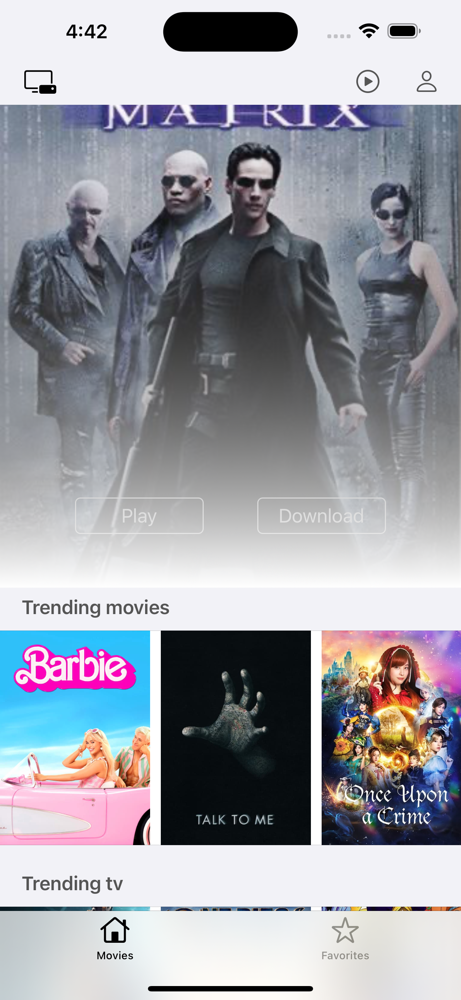
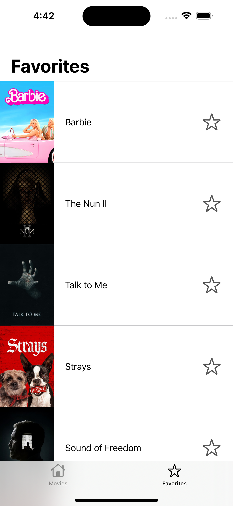
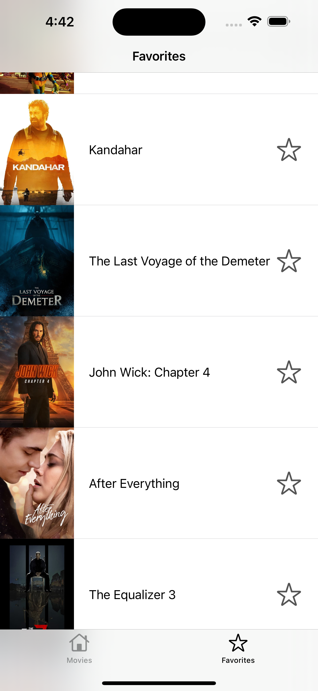

# Movie Gallery

Aplicación desarrollada con el fin de completar el Code Challenge de [Softtek-Coppel].

## Capturas de Pantalla

## Requisitos

- iOS 14.0 o posterior
- Xcode 12.0 o posterior

## Instalación

Para instalar y ejecutar este proyecto en tu máquina local, sigue estos pasos:

1. Clona este repositorio:

   `bash git clone https://github.com/martin-sftk/movie-gallery.git`

## Trabajo en Progreso

- [ ] Falta pantalla de Login
- [ ] Manejo de Favoritos
- [ ] Almacenamiento de Preferencias
- [ ] Perfil de usuario